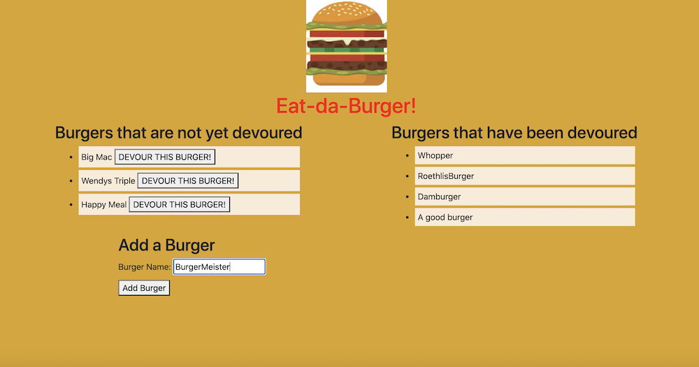
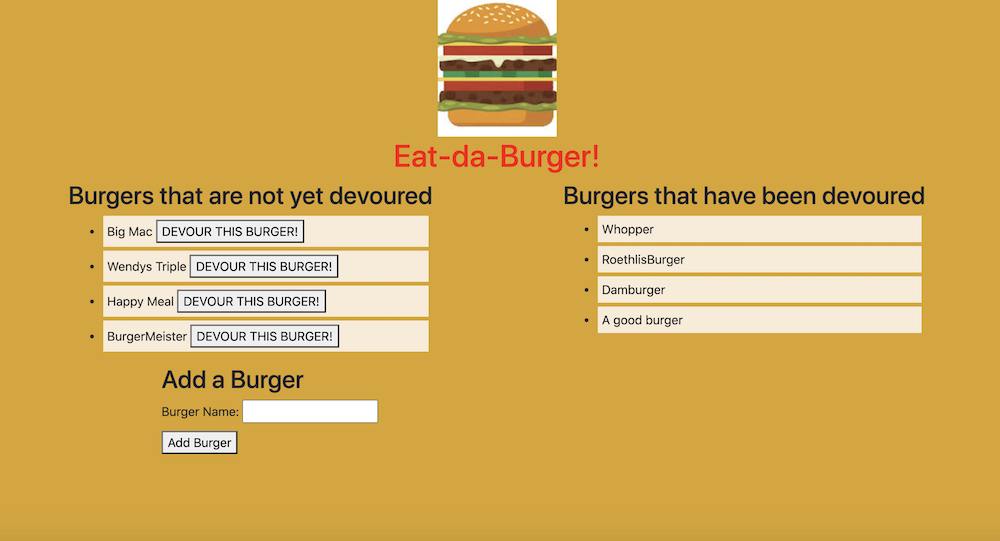
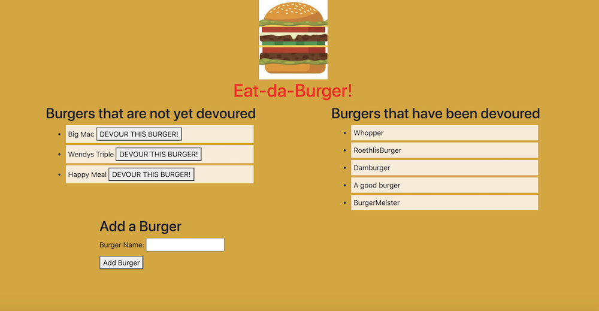

# node-express-handlebars

## Table of Contents
#### &nbsp;&nbsp;&nbsp;&nbsp;[1)&nbsp;Introduction](#introduction)
#### &nbsp;&nbsp;&nbsp;&nbsp;[2)&nbsp;Instructions](#instructions)
#### &nbsp;&nbsp;&nbsp;&nbsp;[3)&nbsp;Features](#features)
#### &nbsp;&nbsp;&nbsp;&nbsp;[4)&nbsp;Usage](#usage)
#### &nbsp;&nbsp;&nbsp;&nbsp;[5)&nbsp;Contributing](#contributing)
#### &nbsp;&nbsp;&nbsp;&nbsp;[6)&nbsp;License](#license)
#### &nbsp;&nbsp;&nbsp;&nbsp;[7)&nbsp;Questions](#questions)   

## Introduction 

This project fulfills a fundamental human need, identifying which burgers you want to eat and then letting you pretend that you are eating them and logging them in as 'devoured.'  Actually what was really important here was the opportunity to use Handlebars, Node, and Express together with a MySql database to combine both front end and back end development, while practicing proper MVC design in the process.

## Instructions

Visit the URL in the browser and type the burger that you want to eat in the 'Add a Burger' form, then click Add Burger or hit enter.  This burger now appears in the left column which is titled 'Burgers that are not yet devoured'.  Users can enter as many burgers as they would like to pretend to eat.  Next to each of those burgers is a button that says 'DEVOUR THIS BURGER!'  When a user clicks on that, the burger moves over the the right column which is titled 'Burgers that have been devoured'.  Once a user is sufficiently hungry in real life, they can then go out and find a real burger to eat, though this is not part of the app's functionality.  

## Features

By utilizing handlebars the HTML is able to be generated without having to manipulate the DOM using jQuery.  MySQL allows creation of a database that includes a table of burgers along with columns to store the values of 'name' and 'devoured', with name being VARCHAR (meaning characters) and devoured being a boolean with a default value of false (i.e. not yet devoured).  An ORM (Object Relational Mapper) simplifies the database query.  GET and POST routes are used to read and write the burger values and through a unique ID that is auto-incremented in the database a particular burger is able to be identified on a click event-listener, and moved from the 'not yet devoured' column to 'devoured.'  The app is deployed to Heroku using JawsDB.

## Usage

The URL for this project is https://node-express-hamburgers.herokuapp.com/

The URL for this project's GitHub repository is: https://github.com/7J647/node-express-handlebars

Users must remember to run "npm install" after cloning this repo.

## Contributing

With thanks to Head Coach Jonathan Watson and his team of TAs and to Josh Furlin for 
providing tutoring on this project. 

## License

MIT License

Copyright (c) 2020 Jeff Flynn

Permission is hereby granted, free of charge, to any person obtaining a copy
of this software and associated documentation files (the "Software"), to deal
in the Software without restriction, including without limitation the rights
to use, copy, modify, merge, publish, distribute, sublicense, and/or sell
copies of the Software, and to permit persons to whom the Software is
furnished to do so, subject to the following conditions:

The above copyright notice and this permission notice shall be included in all
copies or substantial portions of the Software.

THE SOFTWARE IS PROVIDED "AS IS", WITHOUT WARRANTY OF ANY KIND, EXPRESS OR
IMPLIED, INCLUDING BUT NOT LIMITED TO THE WARRANTIES OF MERCHANTABILITY,
FITNESS FOR A PARTICULAR PURPOSE AND NONINFRINGEMENT. IN NO EVENT SHALL THE
AUTHORS OR COPYRIGHT HOLDERS BE LIABLE FOR ANY CLAIM, DAMAGES OR OTHER
LIABILITY, WHETHER IN AN ACTION OF CONTRACT, TORT OR OTHERWISE, ARISING FROM,
OUT OF OR IN CONNECTION WITH THE SOFTWARE OR THE USE OR OTHER DEALINGS IN THE
SOFTWARE.

## Questions

Connect with me at Github: <a href="https://github.com/7J647">7J647</a> &nbsp;&nbsp;&nbsp;&nbsp;
Contact me via Email: [jeffreyedwardflynn@gmail.com](mailto:jeffreyedwardflynn@gmail.com)
